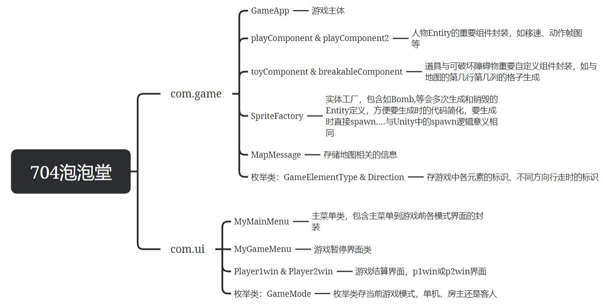
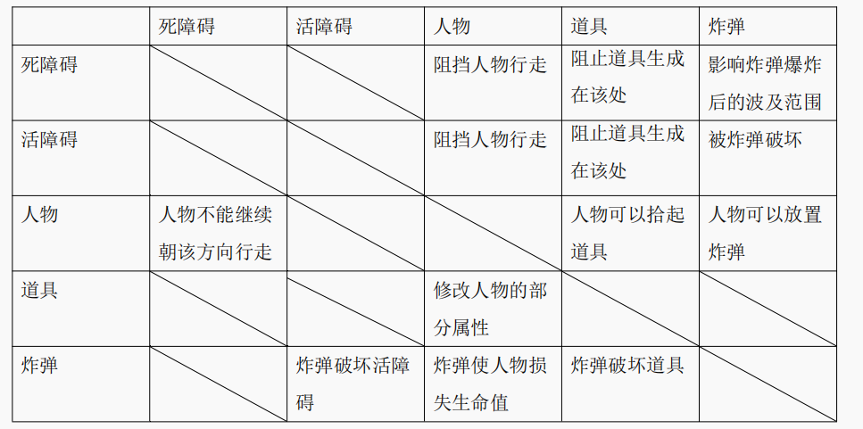

# 提示

1. **由于本项目是在 2023 704大二上初学FXGL引擎与网络编程做的，fxgl找的B站教程没有找到教网络联机部分的，油管的只找到了tcp传包视频，加上看不太懂源码对udp的支持与tcp的差别怕出问题就用tcp作游戏的数据传包了，出现明显延迟，参考时建议改为UDP连接以优化延迟问题。**

2. 联机模式只支持局域网联机，后续可尝试通过内网穿透技术等技术实现异地网络联机。

3. 游戏功能待丰富：由于时间限制未做成有机器人的 4 人单机模式和 4 人的联机模式，项目团队未来可增加更多功能和内容，如新的游戏模式、新地图、更多道具等，以增强游戏的可玩性和长久吸引力。
4. 用到的图像音效音乐素材不太记得具体出处了，部分自己做的部分来自于如站长素材、https://itch.io/game-assets/tag-pixel-art 等免费资源网站，如有看到原作链接请通知我们补上引用。谢谢。

# 1 .项目概述：ava《双人单机+局域网联机Q版泡泡堂》

## 1. 1 基本内容：

本项目是一个基于Java和JavaFX，利用FXGL游戏引擎进行开发的双人游戏，模仿童年4399 游戏泡泡堂。游戏基本逻辑是玩家通过放置炸弹、拾取道具击败其他玩家从而获得胜利。本项目游戏包含双人单机和双人联机模式，游戏界面友好，操作简便，旨在通过本项目熟练应用Java的基础语法，加深对网络编程的理解以及初步学习体会游戏开发Entity-Component-System的概念。

## 1. 2 工作任务的分解和人员分工

③：负责道具的使用和生成、可破坏障碍物的生成、联机模式的实现以及部分音效的处理；
②：负责人物行走、地图绘制以及不可破坏障碍物的生成，以及单机游戏大厅界面的设计；
④：负责游戏的计分与结算系统，游戏中和结束界面的UI设计，以及主要音效添加；
①：负责菜单UI的设计和帮助文档的编写；

## 1. 3 知识点应用等基本说明

**知识点应用：**JAVA基础语法、JAVA网络编程及多线程编程的基础应用

**创新点 ：**采用在GITHUB上开源的基于JAVAFX开发的JAVA游戏引擎FXGL

**技术难点：**

1 . 在游戏引擎对单应用多模式游戏与联机通信的支持一般（或者说因引擎框架限制导致实现部分效果变得较为困难）的情况下实现单机与联机游戏 大 厅并将用户在联机大厅的选择传入游戏本体类；
2 . 联机时保证双方地图随机道具人物行走与攻击爆出道具等游戏元素的一致以及对各种断连的考虑合处理。

# 2 .基本功能

《双人单机+局域网联机Q版泡泡堂》是一款面向 2 名玩家的对战游戏，支持单机和联机两种模式。

 - **单机模式：**两位玩家可以共享同一台电脑的键盘进行游戏。玩家 1 通过“WSAD”键控制角色移动，并通过空格键放置炸弹；而玩家 2 则通过“↑↓← →”键进行移动，并通过回车键放置炸弹。
 - **联机模式：**游戏的联机模式支持局域网内的联机游戏，房主可以创建房间，而其他玩家则可以通过输入局域网IP地址加入房间进行游戏。在联机对战中，玩家通过“WSAD”键控制角色移动，并通过空格键放置炸弹。
 - **规则总概：**本游戏提供了四个不同的角色和三张地图供玩家选择。单机和联机模式开始前，玩家都可以进行选择。每位玩家的初始生命值为 3 ，游戏的时间限制为 180 秒。在游戏过程中，玩家可以捡起各种道具，如鞋子可以加速玩家的移动速度，炸弹可以增加连续放置的炸弹数量，红瓶子可以扩大炸弹的爆炸范围，而蓝瓶子则可以减少炸弹的伤害范围，但不会低于初始的十字伤害。游戏界面的左侧会实时显示每个玩家的生命值和道具数量，并会随着生命值的减少及道具的获取和使用而变化。同时游戏界面也会显示游戏的剩余时间。游戏会对胜负进行判定，在时间结束前存活的一方获胜，如果时间结束时两个玩家均仍存活，则判定为平局。

# 3 .系统设计与实现

## 3. 1 系统架构设计

### 3.1.1 采用技术和平台

- Java: 作为项目的主要编程语言，Java提供了强大的面向对象编程能力，易于处理游戏中的多样化逻辑和数据结构。Java的广泛应用和稳定性也为项目的开发和维护提供了便利。
- JavaFX: 用于开发富客户端应用程序的框架。在本项目中，JavaFX主要用于构建用户界面，如游戏窗口、菜单和游戏中的各种交互元素。JavaFX的高度可定制性和响应式设计能力使得游戏界面更加直观和吸引人。
- FXGL游戏引擎: 一个基于JavaFX的轻量级游戏开发库。它简化了许多常见游戏开发任务，如动画处理、物理模拟、场景管理等。FXGL的使用使得项目能够专注于游戏逻辑和特性的实现，而不必从头开始处理底层的游戏开发细节。此外，FXGL引擎提供了对网络编程支持的API，支持项目实现局域网联机模式。
  - 其中FXGL的github链接如下：
    https://github.com/AlmasB/FXGL/blob/dev/README_CN.md
  - 局域网联机主要参考的FXGL文档链接如下：
    https://github.com/AlmasB/FXGL/wiki/Multiplayer-and-Networking-(FXGL- 11 )
  - 另外项目团队学习FXGL的视频教程链接如下：
    https://www.youtube.com/watch?v=-sXkHTQKszk
    https://www.bilibili.com/video/BV1di4y1r7eG/?spm_id_from=333.337.search-card.all.click

### 3.1.2 系统类图

## 3. 2 功能详细设计

### 3. 2. 1 道具、可破坏障碍物的生成与交互、联机模式

#### 可破坏障碍物、道具的生成与交互

**①可破坏障碍物生成：**为了避免游戏逻辑上的bug，可破坏障碍物的生成位置和总数被设计为确定的；同时为了给玩家增加地图的随机感，三种地图分别具有两种可破坏障碍物的贴图，每局地图生成时采用随机数来决定确定位置要用的的障碍物贴图，避免重复地图的枯燥。
**②可破坏障碍物交互：**玩家可以通过投掷炸弹破坏可破坏障碍物，处于炸弹范围内的可破坏障碍物将被移除并在此局内不再生成，破坏障碍物时有一定几率爆出四种道具内的任意一种。
③道具生成：道具有两种生成方式，一种是于间隔 7 s游戏时间后于地图无障碍物且无可破坏障碍物且无已生成道具的格子根据随机数落在的区间生成四种道具内的任意一种；第二种生成方式则是玩家破坏可破坏障碍物时爆出，为增加游戏性，爆出的道具设计为有一定概率被此炸弹伤害移除。另外一局游戏最多有 20 个道具同时呈现在地图上，超过 20 个后将不会再以任何方式生成道具。
**④道具交互：**道具于游戏中的交互可分为两类——被拾起与被破坏。其中玩家行走时碰到道具则会被视为拾起道具，四种道具的功能简介如下：鞋子增加玩家的移动速度，至一定数量后标识为full继续捡起道具不会再增加玩家速度；炸弹可以增加玩家可连续放置的炸弹数量；红瓶子可以扩大炸弹的爆炸范围，一次向外扩大一圈十字伤害，有效上限为 2 个增幅；蓝瓶子减少炸弹的伤害范围，下限不会低于初始的上下左右各一格的十字伤害。道具除由破坏可破坏障碍物生成时有非常短暂的无敌时间，其余时候皆可被炸弹伤害移除。

#### 联机模式
联机模式的规则同单机模式双人相似，不同主要在于：地图确定为三号地图雪人；规定HOST为p1 ,CLIENT为p2 ；双方都采用WASD和SPACE进行游戏操作；HOST拥有较高权限负责开始游戏并拥有暂停游戏结束游戏回到主界面的权限。
**①HOST与CLIENT的连接：**联机模式采取HOST和CLIENT的交互模式：选择创建房间则被视为HOST，创建房间进入游戏大厅后将会显示“你创建了房间”的消息并显示你创建房间时的ip地址，HOST需要等待CLIENT进入房间才能开始选择角色进入下一步准备游戏开始的步骤；若选择加入房间则被视为CLIENT，加入房间需要输入房主所开房间的ip地址，其中设置了正则表达式判断输入ip的合法性，连接中若无法连接则会弹出错误窗口显示连接错误信息，若连接空房间或超时则会进入空房间，无法进行除回退上一界面的任一操作，若连接成功则会进入HOST房间并收到“你已进入房间”的信息并将此条信息发送给HOST，采用TCP连接。
**②HOST与CLIENT在联机游戏大厅内做游戏准备逻辑设计：**双方进入游戏后可在左下方的聊天框进行聊天，连接成功后HOST可以开始选角色，此时CLIENT不可选角色并提示请等待HOST选取角色，HOST选取好角色后p2 界面中p1 选取的角色将亮起且不可被选择，select按钮亮起表示p 2 可以开始选择角色，p2 选择好角色后p1 界面相应被选择的人物亮起，“START”按钮亮起表示可以开始游戏，点击开始游戏后双方将同时进入游戏。
**③HOST与CLIENT在游戏中的交互：**双方进入游戏后如单机模式一样p 1 生成在左上角，p 2 生
成在右上角，采用局部数据传输的方式同步两边信息，人物行走与炸弹放置动作采取双边传输，
而道具的生成则被设置为HOST单边传输来保证画面的一致和道具不被重复生成，一方生命值
降到 0 时进行游戏输赢判断，同时显示游戏结束界面，连接断开，按RESTART按钮回到游戏主
菜单。

### 3. 2. 2 人物行走、地图、不可破坏障碍物的生成逻辑、单机模式游戏大厅界面设计

#### 人物行走、地图、不可破坏障碍物的生成逻辑：

对于游戏地图，我们用一个二维数组来存储地图的实时状态。元素值为 0 代表当前地块为空，可以进行人物移动或炸弹放置；元素值为 1 代表当前地块上有障碍物，角色和道具都无法位于该地块上；元素值为 2 则代表当前地块有道具生成。地图状态需要根据玩家交互实时更新。在游戏主体中，设置[不可破坏障碍物],[可破坏障碍物],[人物],[道具]，[炸弹]五类可交互元素，对于每一类的功能实现如下：

- 不可破坏障碍物：是提前设置好的、状态不会更改的障碍物，二维数组中不可破坏障碍物所在区域的值永远为 1 。简称“死障碍”。
- 可破坏障碍物：是游戏初始化开始时放置上去的障碍物，每张地图障碍物初始位置固定，但在游戏过程中可以被破坏。可破坏障碍物被破坏后，二维数组对应元素值需要更改为 0 (空地)。简称“活障碍”。
- 人物：玩家操控的主要角色，通过读取键盘输入来控制人物行走、放置炸弹等互动操作。人物数量设置为 2 ，即需要两位玩家。人物通过读取键盘输入来判断行走方向，根据不同方向 播放相应的动作帧图，产生相应的动画效果。人物初始的生命值为 3 ，每次被炸弹伤害后生命值减一，生命值首先达到 0 者判定为输，另一方则胜利。
- 道具：设置四类道具，分别为炸弹、红瓶、蓝瓶、鞋子，效果分别为：增加该玩家最多同时可放置炸弹数、增加炸弹威力、减少炸弹威、提高移动速度。每个道具的个数存放在玩家类的成员变量里，根据其数值对实现对应的道具效果。
- 炸弹：是实现玩家间交互、玩家与地图交互的主要媒介，可以破坏地图、破坏道具、造成伤害。

 游戏逻辑的实现重点在于五个元素间的交互，**列表格如下（列对行的作用）**

人物位置坐标的改变与否是通过目标位置是否存在障碍物实现的。如果不存在障碍物，则根据速度改变相应的人物坐标，达到行走效果；如果存在障碍物则改变坐标后再使坐标回退，从而在视觉上达到人物“原地踏步”的效果。

各元素之间的交互判断是通过碰撞监听实现的。为每个可交互的元素的实体(entity)设置一个碰撞箱，通过FXGL中提供的各类碰撞方法实现交互逻辑。具体实现详见代码。

#### 单机模式游戏大厅界面设计：

单机模式游戏大厅界面重点功能为游戏大厅中的角色选择——实现选择逻辑和用户操作的合法性判断。主要实现功能为：初始状态下，角色图片、select和start按钮为灰色的不可点击状态。玩家 1 首先点击角色图片（透明按钮）选择控制角色，角色图片更改为彩色，select按钮亮起并更改为可点击状态。玩家点击select按钮确定所选角色，该角色则不可被第二个玩家选择。第二个玩家和地图选择操作同理。只有在两个玩家都已经选择了角色和地图后，start按钮才会亮起，玩家才可以开始游戏。

### 3. 2. 3 游戏的计分与结算系统、游戏中和结束界面的UI设计、及主要音效添加

- **游戏计分功能：**游戏计分功能和p 1 ,p 2 角色在地图上的触发的事件绑定，负责初始化人物的生命值，移动速度，炸弹数量，爆炸伤害范围等信息，随着游戏过程中人物与周围实体的碰撞，如人物与爆炸形成的火焰发生碰撞后，人物生命减一，在GameVars里面和屏幕上显示的血量绑定，在画面左边的人物信息栏进行实时的显示。
- **游戏结算系统：**创建三个子界面，分别对应三种游戏结束情况，即：p 2 血量清零，p1 胜利，p1 血量清零，p2 胜利，游戏时间结束，二者血量都为清零，即为平局。游戏阶段界面中若有输赢则对两名玩家的状态分别显示，赢家用王冠标志状态，输者的图标变成黑白色，鼠标移动到二者头像上时会自行播放音效。结算菜单有两个功能性按钮，即退出游戏或者返回主菜单。
- 音效添加：主要体现在切换场景时对应背景音乐改变，在点击可点击按钮，比如选择角色，确定角色时能够发出对应音效方便玩家确认点击效果。不同按钮之间对应的音效不同。鼠标移动到按钮上也会有对应音效，以丰富玩家的游玩体验。游戏地图内所操纵角色放下炸弹，炸弹爆炸，被炸弹火焰伤害，拾取到道具气泡时都会产生对应音效，实现游戏效果。
- **游戏中及结束界面的ui设计：**游戏中及结束界面的ui设计的主要操作是创建在固定位置的entity实体，用指定的被禁图片进行贴图，在中间的位置留出放置地图的空间，在后续工作中与组内成员设计实现的地图块耦合。

### 3. 2. 4 菜单UI的设计和帮助文档的编写

- **菜单界面UI设计：**在主界面设置四个按钮，分别为跳转单机模式，跳转联机模式，查看帮助和退出功能，并贴上相对应的图像，当鼠标移动到各个选项上方时，按钮图像切换为字体周围发光的图像，移开后发光消失，以此呈现鼠标移至按钮上，按钮发光的效果。编写帮助文档，在游戏内介绍游戏基本玩法和功能，点击主界面菜单的HELP即可跳转查看帮助文档，在文档左下角可点击MENU按钮跳转回主界面。

## 3. 3 编码实现

编码实现重点在游戏主体类GameApp的实现、主菜单类的实现、联机模式的实现以及以人物组件类的实现为例展示Component类的作用。

### **3. 2. 3 GameApp** 类 **:** 游戏主体
利用FXGL，若制作非常简单的小游戏只需要这一个类，在这个类里，FXGL提供几个可覆写的方法：initUI,initPhysics,initSettings等来供玩家编写自己游戏相关功能的代码，使用时最好打印执行时所在的线程方便设计游戏代码的放置位置。本项目本体即在覆写这几个方法的基础上通过封装众多功能函数与独立出其他类来实现。

### **3. 3. 2 MyMainMenu** 类：主菜单 **UI** 代码实现

FXGL的有默认的主菜单界面，想要自定义的主菜单界面，需要另开一个类继承FXGLMenu类并选择标识是自定义主菜单而非游戏中暂停界面菜单，菜单界面中为了实现各个游戏前界面的跳转，保证不脱离FXGL的框架采用将每个界面用函数封装，跳转时清屏调用下一个界面函数的方式来实现伪界面跳转，其中注意在originMenu函数里封装主菜单界面时要同时将所用到的用于选择的一些标识变量恢复到默认状态。

MyGameMenu同理，为对FXGLGameMenu的重写。

### 3. 3. 3 联机模式实现

**①房主创建房间的实现：**

在MyMainMenu类的crtRoom函数中，默认房主名为HOST，点击创建房间后检验房间是否可创建。

房间创建成功后进入新界面开启FXGL的网络服务，创建一个TCPserver并等待连接，设置监听连接的事件监听器以及监听来自client的信息的信息监听器。

**②客户加入房间实现：**

在MyMainMenu类的joinRoom函数中，默认客户昵称为player 2 ，输入房间ip地址后先检验房间ip是否合法再检验房间是否可以连接，若无法连接则会弹出错误窗口显示连接错误信息，若连接空房间或超时则会进入空房间，无法进行除回退上一界面的任一操作，若可连接则跳转至联机游戏大厅界面开启FXGL的网络服务，创建一个TCPclient并连接房间，设置监听连接的事件监听器以及监听来自server的信息的信息监听器，连接一旦成功则接受来自HOST的房间信息并发送我已进入房间的信息给sever。

**③HOST和CLIENT信息收发实现**

略。

### **3. 3. 4 playerComponent** 类

人物类的部分主要代码。

